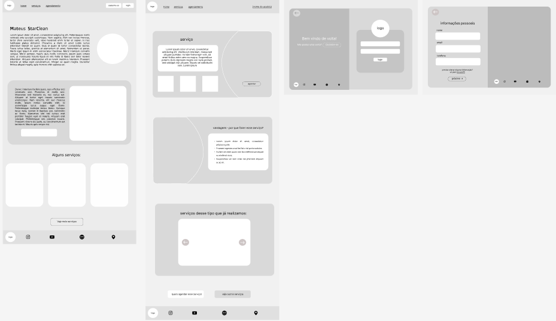
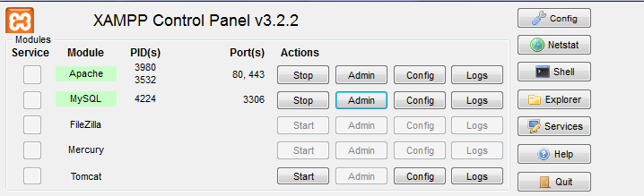
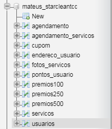
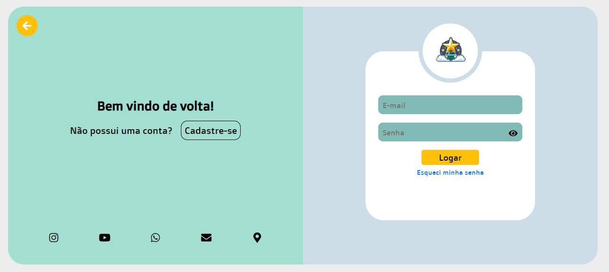
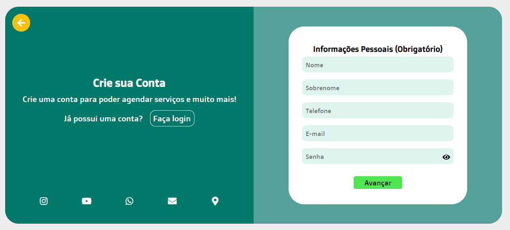
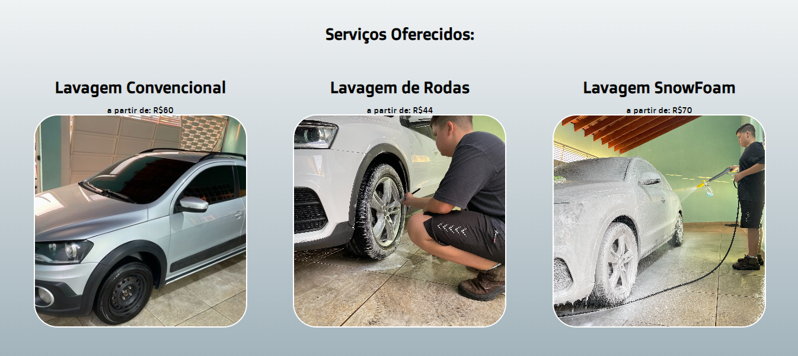
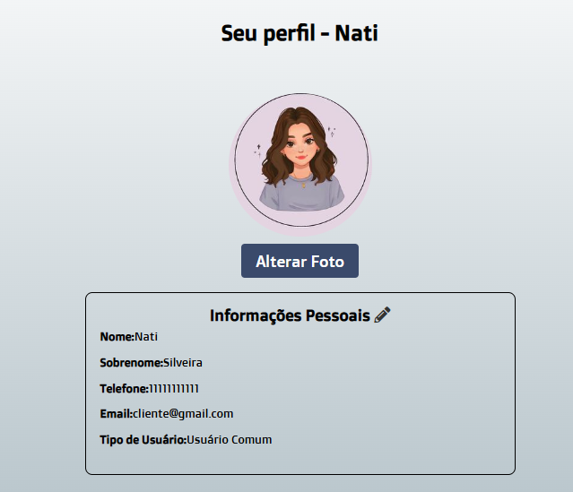
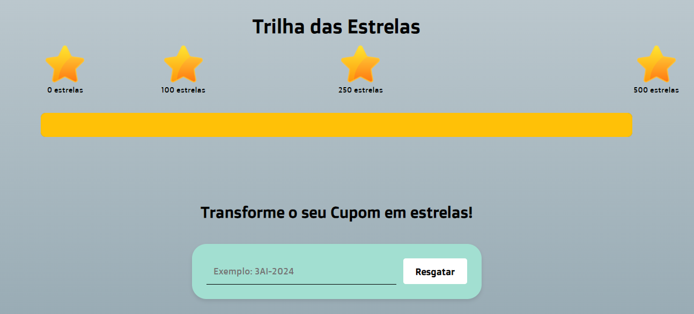
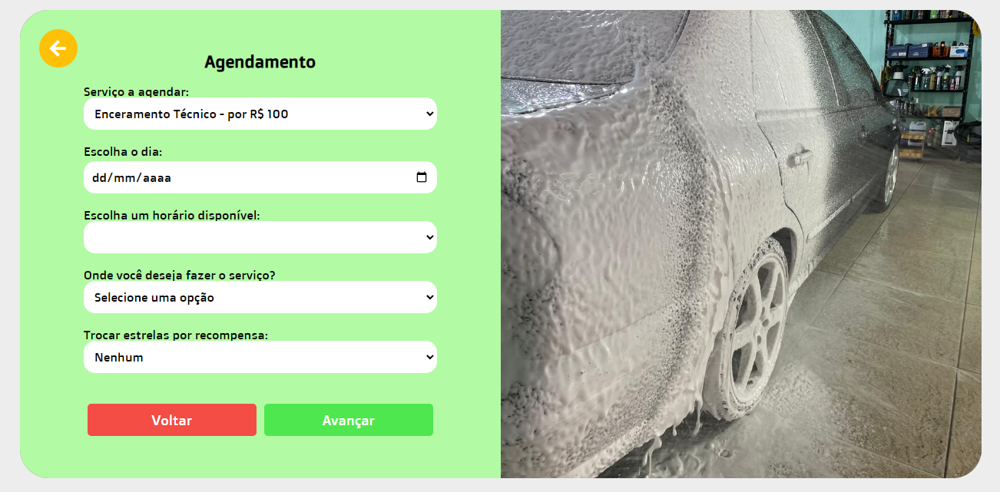

# Mateus StarClean

<p align="center" style="display: flex; align-items: flex-start; justify-content: center;">
  
</p>


## 💻 Sobre o projeto

<h3>Trabalho de conclusão de curso - Mateus StarClean</h3>

<h3>Descrição</h3>

<p>Este projeto foi desenvolvido como parte do Trabalho de Conclusão de Curso (TCC) para o ensino médio integrado ao técnico em informática para internet na ETEC de Campo Limpo Paulista. Ele aborda a importância da identidade visual, com o objetivo de propor melhorias no marketing para um empreendimento de estética automotiva.</p> 

<H4>Este trabalho foi feito por:</H4>
<p>Fernanda Caroline Santos Pereira</p>
<p>Natália Araújo da Silveira</p>

<h4>Com as Orientadoras:</h4>
<p>Thaynara Cristina Maia dos Santos e Barbara Kathellen Andrade Porfirio</p>

<h3>Por que este projeto foi feito?</h3>

<p>A motivação para o desenvolvimento deste projeto surgiu da necessidade de aprimorar o marketing do empreendimento de estética automotiva de Mateus Araújo da Silveira, um empreendedor autônomo livre. Seu negócio enfrentava dificuldades devido à ausência de uma identidade visual coesa e alinhada com os valores da empresa, o que comprometia sua capacidade de atrair e fidelizar clientes. A falta de uma identidade visual impactante resultava em uma percepção de marca pouco definida e pouco atrativa, prejudicando a estratégia de marketing e dificultando o posicionamento no mercado competitivo. Nesse contexto, este trabalho propôs a renovação completa da identidade visual, com o objetivo de fortalecer a imagem do empreendimento e destacar sua personalidade no setor automotivo. </p>

<h3>Com este trabalho, buscamos: </h3>

<p>•	Criar uma nova identidade visual e desenvolver um manual da marca: Proporcionando uma representação coesa e atrativa que reflita os valores e objetivos do empreendimento.</p>
	
<p>•	Definir o público-alvo: Identificando e compreendendo as características do público a ser atendido, para direcionar de forma eficaz as estratégias de comunicação e marketing.</p>
	
<p>•	Desenvolver um sistema web: Integrar a nova identidade visual ao ambiente digital, automatizando o processo de agendamento de serviços, facilitando o atendimento ao cliente e fortalecendo a conexão entre a marca e seus consumidores.</p>

---

## 🎨 Layout

O layout da aplicação está disponível no Figma:

<a href="https://www.figma.com/design/llPQrYPKagCTNI6b7CsW7Y/Prot%C3%B3tipo-M%C3%A9dia-Fidelidade---Mateus-StarClean-(Copy)?node-id=0-1&m=dev&t=Es42Igk6dqHlCx47-1">
  
</a>

### Web

<p align="center" style="display: flex; align-items: flex-start; justify-content: center;">
  
</p>

---

## 🛣️ Como executar o projeto

Este projeto é divido em cinco partes:
1. Backend (pasta server) 
2. html (pasta web)
3. css (pasta estilização)
4. src (pasra de arquivos)
5. vendor (para utilização do composer)


💡 Recomendamos que baixe o composer para a utilização destes arquivos para uma melhor experiência.

Link de instalação:

<a href="https://getcomposer.org/download/">
  
</a>

### Pré-requisitos

Antes de começar, você vai precisar ter instalado em sua máquina as seguintes ferramentas:
[Xampp](https://sourceforge.net/projects/xampp/files/XAMPP%20Windows/8.0.30/xampp-windows-x64-8.0.30-0-VS16-installer.exe/download), [Composer](https://getcomposer.org/download/). 

Antes de rodar a aplição coloque todos os arquivos em uma só pasta.

#### 🎲 Rodando o Backend (servidor)

Para rodar o backendo será necessário abrir o xampp e acionar os dois primeiro botões como mostra abaixo:

<p align="center" style="display: flex; align-items: flex-start; justify-content: center;">
  
</p>

Após abrir, clique no admin do mysql, adicione um novo banco de dados com o nome de Mateus_StarCleanTCC, e importe no banco de dados o arquivo que está no backend e dentro da pasta database. Ficará assim:

<p align="center" style="display: flex; align-items: flex-start; justify-content: center;">
  
</p>

Seu banco de dados está pronto para rodar

#### 🧭 Rodando a aplicação web (html)

Para rodar esta parte basta baixar as pasta como foi pedido no começo e esta pronto para mexer, logo de primeira página, temos a história da marca, que é para você conhecer melhor sobre o empreendimento e sua trajetória no mercado automotivo. 

<p align="center" style="display: flex; align-items: flex-start; justify-content: center;">
  
</p>

Também temos como logar e se cadastrar:

<p align="center" style="display: flex; align-items: flex-start; justify-content: center;">
  
</p>
<p align="center" style="display: flex; align-items: flex-start; justify-content: center;">
  
</p>
 
 
Angendar os serviços que vçao estar disponíveis na página:

<p align="center" style="display: flex; align-items: flex-start; justify-content: center;">
  
</p>


A página perfil:

<p align="center" style="display: flex; align-items: flex-start; justify-content: center;">
  
</p>


E se estiver interessado em ver nossa pagina de administrador basta colocar esse email e senha de login

``` bash
fc7226125@gmail.com -> espanha (Administrador)
fernanda@gmail.com -> espanha (Cliente)
```

O administrador pode gerenciar serviços, usuários, cupons e prêmios e ver o serviços agendados pelos clientes.


<p align="center" style="display: flex; align-items: flex-start; justify-content: center;">
  
</p>

O usuário Cliente pode agendar serviços, ver seus serviços agendados e usufruir do programa de fidelidade. 

<p align="center" style="display: flex; align-items: flex-start; justify-content: center;">
  
</p>


<p align="center" style="display: flex; align-items: flex-start; justify-content: center;">
  
</p>


---

##  Citação

``` bash

PEREIRA, Fernanda; SILVEIRA, Natalia; LIMA, Willian. Identidade visual e marketing: justificativas e proposta para o redesign de uma estética automotiva. 2024. 40 p. Artigo.

```
##  Autoras

 <br />
 <sub><b>Fernanda Pereira</b></sub></a>✨</a>
 <br />
 
 <br />
 <sub><b>Natalia Silveira</b></sub></a>✨</a>
 <br />

---

## 📝 Licença

<!-- Este projeto esta sobe a licença [ETEC](./LICENSE). -->

Feito com ❤️ por Fernanda Pereira e Natalia Silveira 👋🏽 [Entre em contato!](https://www.instagram.com/FernandaPereira529)

